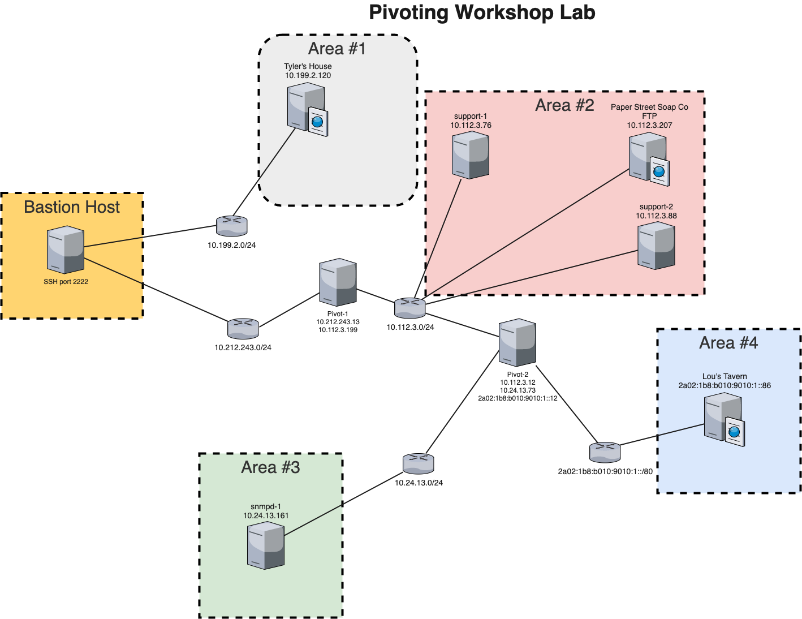

# Pivoting Workshop
## Lab Hosts
167.172.227.234

68.183.145.71 

167.71.88.196 

165.22.40.199 

68.183.148.43 

157.245.12.197 

157.245.15.122 

167.71.254.22 

157.245.4.40 

134.209.33.126 

159.65.250.65 

161.35.143.183 

159.65.248.117 

167.99.123.228 

164.90.133.36 

142.93.179.207 

167.172.250.153

164.90.133.50 

159.65.180.184 

161.35.131.160 


## workshop progress tracker
https://workshop.threatsims.com


## network map



## Let's Tunnel

### bastion host - flag 0
SSH to the bastion host on a non-standard port.  Your bastion host is the one assigned to you from the above list of lab hosts.  Throughout this workshop using 'man ssh' and google are very useful.

User: bastion

Password: bastion

SSH Port: 2222

run a 'netstat -ant' or 'ss -nt' before and after you establish each connection to understand what ssh network connections that you created.  Also run a 'ps -ef' to understand what processes are running.
<details>
  <summary>Hint</summary>
use -p <port> to specify a non-standard port
</details>
<details>
  <summary>Tip</summary>
use -o StrictHostKeyChecking=no to streamline logging in, but this is bad opsec for known good hosts
</details>
<details>
  <summary>Solution</summary>
ssh -p 2222 bastion@<host> -o StrictHostKeyChecking=no
</details>

### Web - flag 1
Since we cannot browse directly to this website as it is on a private IPv4 address we must create a forward tunnel to it.

Browse to http://10.199.2.120/

<details>
  <summary>Hint</summary>
use -L <port>:<Destination IP>:<port> for a forward tunnel
</details>
<details>
  <summary>Tip</summary>
use -D <port> to create a dynamic SOCKS5 proxy
</details>
<details>
  <summary>Solution</summary>
ssh -p 2222 bastion@<host> -o StrictHostKeyChecking=no -L8081:10.199.2.120:80

curl 127.0.0.1:8081

OR

ssh -p 2222 bastion@<host> -o StrictHostKeyChecking=no -D9050

curl -x socks5h://localhost:9050 http://10.199.2.120

OR

specify a SOCKS5 proxy in your web browser.  FoxyProxy is a popular firefox plugin to enable quick swithcing between proxies.
</details>


### pivot-1 - flag 2
Just like with the web challenge create a forward tunnel to the pivot server

IP: 10.212.243.13

User: tyler

Pass: fightclub

<details>
  <summary>Hint</summary>
use -L <port>:<Destination IP>:<port> for a forward tunnel
</details>
<details>
  <summary>Bonus Tip</summary>
use -J <user>@<host>:<port> to specify a Jump Host that you will SSH through, a forward tunnel is not needed if using the -J option
</details>
<details>
  <summary>Bonus Tip</summary>
you can use some sshuttle here as well, sshuttle -h is your friend.
</details>
<details>
  <summary>Solution</summary>
ssh -p 2222 bastion@<host> -o StrictHostKeyChecking=no -L2223:10.212.243.13:22

ssh -p 2223 tyler@127.0.0.1 -o StrictHostKeyChecking=no

OR

ssh -J bastion@<host>:2222 tyler@10.212.243.13 

</details>


### beaconing - flag 3
Something is Beaconing to the pivot on port 58671-58680 to ip 10.112.3.199, can you tunnel it back?

This will be your first reverse tunnel and you will need something to catch the beacon, may I suggest nc or ncat.

NOTE: IT IS THE SAME ON EACH PORT ONLY USE ONE PORT AND REMOVE YOUR TUNNEL WHEN YOU ARE DONE

<details>
  <summary>Hint</summary>
use -R <Remote Host IP>:<port>:<Local Destination IP>:<port> for a reverse tunnel
</details>
<details>
  <summary>Bonus Tip</summary>
use -J <user>@<host>:<port> to specify a Jump Host that you will SSH through, a forward tunnel is not needed if using the -J option
</details>
<details>
  <summary>Solution</summary>
ssh -p 2222 bastion@<host> -o StrictHostKeyChecking=no -L2223:10.212.243.13:22

ssh -p 2223 tyler@127.0.0.1 -o StrictHostKeyChecking=no -R10.112.3.199:58671:127.0.0.1:58671

nc -klvp 58671

OR

ssh -J bastion@<host>:2222 tyler@10.212.243.13 -R10.112.3.199:58671:127.0.0.1:58671

nc -klvp 58671
</details>


### random beacon - flag 4
This is just like the last one except that you have to be a lot quicker.  I would recommend setting up your local 

Connect to ip: 10.112.3.88 port: 7000, a beacon awaits you, but you have to be quick


<details>
  <summary>Hint</summary>
use -R <Remote Host IP>:<port>:<Local Destination IP>:<port> for a reverse tunnel
</details>
<details>
  <summary>Bonus Tip</summary>
You can use -D <port> again for dynamic
</details>
<details>
  <summary>Solution</summary>
Forward Tunnels
```
ssh -p 2222 bastion@<host> -o StrictHostKeyChecking=no -L2223:10.212.243.13:22

ssh -p 2223 tyler@127.0.0.1 -o StrictHostKeyChecking=no -L7000:10.112.3.88:7000

nc 127.0.0.1 7000
```
Dynamic tunnels
```
ssh -p 2223 tyler@127.0.0.1 -o StrictHostKeyChecking=no -D9050

ncat --proxy 127.0.0.1:9050 --proxy-type socks5 10.112.3.88 7000
```

On pivot 1

~C
-R10.112.3.199:XXX:127.0.0.1:8000


Locally

nc -klvp 8000

</details>


### ftp - flag 5
We deployed a ftp server but we forgot which port (I know we will be better next time), find it and connect, you may find more than a flag.

ftp: 10.112.3.207

user: tyler

pass: squanderedpotential

<details>
  <summary>Hint 1</summary>
You can use -D <port> again for dynamic
</details>
<details>
  <summary>Hint 2</summary>
proxychains is very useful for using tools through tunnels that are not designed for tunnels.  They are also useful when tunneling traffic to many IPs and/or ports.
</details>
<details>
  <summary>Solution</summary>
ssh -p 2222 bastion@<host> -o StrictHostKeyChecking=no -L2223:10.212.243.13:22

ssh -p 2223 tyler@127.0.0.1 -o StrictHostKeyChecking=no -D9050


proxychains nmap -Pn -sT -p- 10.112.3.207

proxychains ftp 10.112.3.207 53121

</details>
<details>
  <summary>Spoiler</summary>
proxychains ftp 10.112.3.207 53121

dir

get id_ed25519

NOTE: YOU CAN NOW USE THE KEY FOR BASTION PIVOT-1 and PIVOT-2
</details>


### pivot-2 - flag 6
Just another pivot, because why not.  You know how to forward tunnel, but now we need to level up your game a bit. 'man ssh_config' is a little daunting, but all we are doing is specifying command line options in the file.  Also we forogot the password again, but luckily we left something on the ftp server for you.

Connect to the second pivot

IP: 10.112.3.12

User: paulson

Pass: (I forgot)

<details>
  <summary>Hint 1</summary>
We are using lots of terminals, this can be useful reducing the number of terminal windows open

background the ssh connection with -f

do not execute remote commands -N
</details>

<details>
  <summary>Solution</summary>
ssh -p 2222 -i id_ed25519 bastion@<host> -o StrictHostKeyChecking=no -L2223:10.212.243.13:22 -fN

ssh -p 2223 -i id_ed25519 tyler@127.0.0.1 -o StrictHostKeyChecking=no -L2224:10.112.3.12:22 -fN

ssh -p 2224 -i id_ed25519 paulson@127.0.0.1 -o StrictHostKeyChecking=no

OR

ssh -F ssh_config pivot-2

</details>

<details>
  <summary>Spoiler - save this for later</summary>

We are taking the '-J <user>@<host>:<port>' jump host and leveling it up with '-F ssh_config'.

These config options should look familiar with what we have been doing on the command line.  In addition to what we had previously done on the command line, we are adding ProxyJump option.  The ProxyJump option specifies that in order to connect to this host you must use this other host to connect to it.  Notice in the config we are chaing the hosts, pivot-2 needs to connect via pivot-1 and pivot-1 needs to connect via bastion.

You may need to update 'IdentityFile id_ed25519' if the private key is not in your current directory.

see the file ssh_config in the repo.
</details>


### snmpd - flag 7
If you haven't noticed so far, all of our traffic has been TCP and IPv4.  Well that is gonna change, let's do some UDP.  You can't just push UDP traffic into a TCP tunnel, you need to use a tool to change it from UDP to TCP.  Don't forget that you need to change it back to UDP before sending to the target.

There is a snmp server at 10.24.13.161


<details>
  <summary>Hint 1</summary>
bastion and pivot-1 have GatewayPorts, TCP forwarding and tunnels enabled, however pivot-2 does not.  You will need to use a tool to do that. 
</details>
<details>
  <summary>Hint 2</summary>
socat is available on pivot-2.  Your tunnels may fail without error if you create tunnels.
</details>
<details>
  <summary>Solution</summary>
tunnel to point to pivot-2 as GatewayPorts Tunneling and TCP forwarding are all disabled

ssh -F ssh_config pivot-1 -L9161:10.112.3.12:9161

ssh to pivot-2

ssh -F ssh_config pivot-2

socat TCP4-LISTEN:9161,reuseaddr,fork UDP:10.24.13.161:161 &

locally

socat -T15 udp4-recvfrom:161,reuseaddr,fork tcp:localhost:9161 &

snmpwalk -v 2c -c public localhost

</details>


### web-2 - flag 8
Just like you learned with using socat to change from UDP <> TCP <> UDP, you can also use socat to go IPv4 <> IPv6 

Browse to http://2a02:1b8:b010:9010:1::86/


<details>
  <summary>Hint 1</summary>
bastion and pivot-1 have GatewayPorts, TCP forwarding and tunnels enabled, however pivot-2 does not.  You will need to use socat
</details>

<details>
  <summary>Hint 2</summary>
socat is available on pivot-2.  Your tunnels may fail without error if you create tunnels.
</details>

<details>
  <summary>Solution</summary>
tunnel to point to pivot-2 as GatewayPorts Tunneling and TCP forwarding are all disabled

ssh -F ssh_config pivot-1 -L8082:10.112.3.12:8082

ssh to pivot-2

ssh -F ssh_config pivot-2

socat TCP-LISTEN:8082,reuseaddr,fork TCP6:[2a02:1b8:b010:9010:1::86]:80 &

locally

curl 127.0.0.1:8082

</details>


